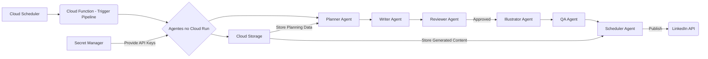

```markdown
# Hub de Agentes para Produção de Conteúdo no LinkedIn

Este projeto visa criar um sistema automatizado para a produção consistente de conteúdo educacional sobre estatística, machine learning e inteligência artificial para o LinkedIn. Através da orquestração de agentes autônomos baseados em Large Language Models (LLMs), o sistema gera um artigo principal e cinco posts menores por semana, otimizando o tempo e a qualidade da criação de conteúdo.

## Visão Geral do Projeto

O Hub de Agentes automatiza o ciclo de vida da criação de conteúdo, desde o planejamento de temas até a programação da publicação no LinkedIn. O sistema é composto por diversos agentes especializados que colaboram para produzir conteúdo de alta qualidade, mantendo um tom informal e sério, e focando em um nível educacional para o público.

**Objetivos:**

* Produzir consistentemente 1 artigo principal e 5 posts menores por semana no LinkedIn.
* Abordar temas de estatística, machine learning e inteligência artificial em um nível educacional.
* Manter um tom de voz informal e sério.
* Automatizar o processo de criação de conteúdo para aumentar a eficiência.
* Utilizar o feedback do desempenho do conteúdo para otimizar futuras produções.

## Arquitetura no Google Cloud Platform (GCP)

A implantação deste projeto no GCP será realizada utilizando os seguintes serviços:

* **Cloud Run:** Para hospedar os agentes como serviços containerizados. O Cloud Run permite escalabilidade automática e gerenciamento simplificado dos containers Docker.
* **Cloud Functions:** Para executar tarefas específicas e event-driven, como o agendamento semanal do pipeline e possíveis integrações com outras APIs.
* **Cloud Storage:** Para armazenar dados persistentes, como o arquivo de planejamento JSON, conteúdo gerado antes da publicação e logs.
* **Secret Manager:** Para gerenciar de forma segura as chaves de API (ex: OpenAI API key) e outras informações confidenciais.
* **Cloud Scheduler (Cron Jobs):** Para acionar periodicamente a execução do pipeline de conteúdo.

**Diagrama de Arquitetura (Conceitual):**



## Estrutura do Repositório

```
├── .github/workflows/
│   └── main.yml         # Workflow de CI/CD para GCP
├── agents/
│   ├── planner.py
│   ├── writer.py
│   ├── reviewer.py
│   ├── illustrator.py
│   ├── scheduler.py
│   └── qa.py
├── config/
│   └── config.yaml      # Configurações do projeto (ex: templates de prompt)
├── data/
│   └── planning.json    # Arquivo JSON de planejamento semanal
├── docs/
│   └── architecture.md  # Documentação detalhada da arquitetura
│   └── agents.md        # Documentação dos agentes
├── notebooks/           # Jupyter notebooks para experimentação e testes
├── output/              # Diretório para armazenar o conteúdo gerado antes da publicação
├── requirements.txt
├── scripts/
│   └── run_pipeline.py  # Script para executar o pipeline localmente
│   └── deploy_gcp.sh    # Script para deploy no GCP
├── tests/
│   ├── test_planner.py
│   └── ...
├── Dockerfile           # Dockerfile para containerizar os agentes
├── README.md
└── LICENSE              # (Opcional) Licença do projeto
```

## Configuração Local

Para executar o projeto localmente, siga os seguintes passos:

1.  **Clone o repositório:**
    ```bash
    git clone <URL_DO_REPOSITORIO>
    cd <NOME_DO_REPOSITORIO>
    ```

2.  **Crie um ambiente virtual (recomendado):**
    ```bash
    python3 -m venv venv
    source venv/bin/activate  # No Linux/macOS
    venv\Scripts\activate  # No Windows
    ```

3.  **Instale as dependências:**
    ```bash
    pip install -r requirements.txt
    ```

4.  **Configure as variáveis de ambiente:**
    * Crie um arquivo `config/config.yaml` e adicione suas chaves de API da OpenAI. Exemplo:
        ```yaml
        openai_api_key: "SUA_CHAVE_API_OPENAI"
        ```

5.  **Execute o pipeline localmente (exemplo):**
    ```bash
    python scripts/run_pipeline.py
    ```
    *(Este script precisará ser implementado para orquestrar a execução dos agentes localmente).*

## Deployment no GCP

O deployment no GCP envolverá os seguintes passos:

1.  **Containerização com Docker:** Os agentes serão empacotados em containers Docker definidos pelo `Dockerfile`.

2.  **Push para o Container Registry:** As imagens Docker serão enviadas para o Google Container Registry.

3.  **Deployment no Cloud Run:** Os serviços do Cloud Run serão configurados para executar os containers dos agentes.

4.  **Criação de Cloud Functions:** As Cloud Functions necessárias para o agendamento e outras tarefas serão criadas.

5.  **Configuração do Cloud Scheduler:** Um job do Cloud Scheduler será configurado para acionar a Cloud Function que inicia o pipeline semanalmente.

6.  **Gerenciamento de Secrets:** As chaves de API e outras informações sensíveis serão armazenadas e acessadas através do Secret Manager.

## Próximos Passos

O desenvolvimento deste projeto será realizado em fases:

### Fase 1: MVP (Minimum Viable Product)

* Implementação dos agentes **Planner** e **Writer**.
* Criação de um script básico para execução local do planejamento e geração de conteúdo (artigo principal e um post).
* Estrutura básica do repositório e configuração inicial do Git.
* Definição do schema JSON de planejamento.
* Containerização básica com Docker.

### Fase 2: Beta

* Implementação dos agentes **Reviewer** e **Scheduler**.
* Integração básica com a API do LinkedIn (simulação de publicação ou salvamento do conteúdo no formato adequado).
* Implementação de testes unitários para os agentes principais.
* Configuração inicial do Cloud Run para os agentes.
* Implementação de um Cloud Function para simular o trigger do pipeline.

### Fase 3: Produção

* Implementação completa do agente **Illustrator** e **QA**.
* Integração robusta com a API do LinkedIn para publicação automática.
* Implementação de testes de integração e end-to-end.
* Deployment completo no GCP (Cloud Run, Cloud Functions, Cloud Scheduler, Secret Manager, Cloud Storage).
* Monitoramento e logging do sistema.
* Implementação de um sistema de feedback para o Planner.

## Contribuição

Contribuições para este projeto são bem-vindas. Por favor, consulte o arquivo `CONTRIBUTING.md` para obter detalhes sobre como contribuir.

## Licença

[ADICIONE A LICENÇA DO SEU PROJETO AQUI] (Opcional)
```
