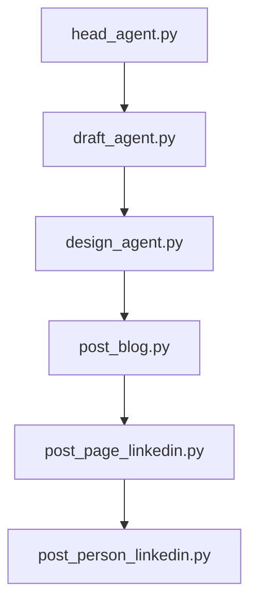

# Hub-BlogLinkedinContent 🛰️

*Automação de criação, revisão e publicação de artigos e posts educativos sobre Estatística, Machine Learning e IA.*


---

## 📑 Índice

1. [Visão Geral](#visão-geral)
2. [Arquitetura de Agentes](#arquitetura-de-agentes)
3. [Estrutura do Repositório](#estrutura-do-repositório)
4. [Pré-requisitos](#pré-requisitos)
5. [Variáveis de Ambiente](#variáveis-de-ambiente)
6. [Uso Local](#uso-local)
7. [Deploy no Google Cloud Run](#deploy-no-google-cloud-run)
8. [CI/CD](#cicd)
9. [Roadmap](#roadmap)
10. [Contribuição](#contribuição)
11. [Licença](#licença)

---

## Visão Geral

Este repositório orquestra **agentes autônomos** que usam Google Cloud Storage como repositório central:

1. **head\_agent.py**: cria um JSON com temas e tópicos.
2. **draft\_agent.py**: gera rascunho detalhado do artigo para blog.
3. **design\_agent.py**: transforma o conteúdo em HTML.
4. **post\_blog.py**: publica o HTML no Blogger.
5. **post\_page\_linkedin.py**: publica texto + link do blog na página do LinkedIn.
6. **post\_person\_linkedin.py**: publica texto + link do blog no feed pessoal.

Todo input e output de cada passo é armazenado em um **bucket GCS** configurável.

---

## Arquitetura de Agentes



| Agente / Script               | Descrição                                                                        |
| ----------------------------- | -------------------------------------------------------------------------------- |
| **head\_agent.py**            | Lê planning.json no bucket, gera JSON com `theme` e lista `topics`.              |
| **draft\_agent.py**           | Recebe JSON de temas/tópicos e preenche `draft` com parágrafos para cada tópico. |
| **design\_agent.py**          | Converte JSON + rascunho em HTML final para publicação.                          |
| **post\_blog.py**             | Usa API do Blogger para publicar artigo a partir do HTML.                        |
| **post\_page\_linkedin.py**   | Publica artigo longo (texto + link) na seção de artigos do LinkedIn.             |
| **post\_person\_linkedin.py** | Publica post curto (texto + link) no feed pessoal do LinkedIn.                   |

---

## Estrutura do Repositório

```text
hub-linkedincontent/
├── .github/workflows/           # CI/CD GitHub Actions
│   └── ci.yml
├── acesso/                      # credenciais e tokens
│   ├── blogger_token.json
│   ├── blogger.json
│   └── zore.json
├── scripts/                     # código dos agentes e utilitários
│   ├── head_agent.py
│   ├── draft_agent.py
│   ├── design_agent.py
│   ├── post_blog.py
│   ├── post_page_linkedin.py
│   ├── post_person_linkedin.py
│   └── utils.py
├── get_token_blogger.py         # script para obtain/refrescar token Blogger
├── .env.example                 # template de variáveis de ambiente
├── Dockerfile                   # containerização
├── README.md                    # este arquivo
└── requirements.txt             # dependências Python
```

---

## Pré-requisitos

* **Python 3.12**
* **Docker 20+** (opcional para ambiente local)
* Conta GCP com bucket habilitado
* `gcloud CLI` autenticado (`gcloud init`)
* Chave de API OpenAI e OAuth Blogger

---

## Variáveis de Ambiente

Copie e ajuste:

```bash
cp .env.example .env
```

| Variável                     | Descrição                                |
| --------------------         | ---------------------------------------- |
| `OPENAI_API_KEY`             | Chave da API OpenAI                      |
| `GCP_PROJECT`                | ID do projeto no Google Cloud            |
| `BUCKET_NAME`                | Nome do bucket GCS para leitura/escrita  |
| `BLOGGER_TOKEN_PATH`         | Token Blog                               |
| `BLOGGER_ID`                 | ID do Blog                               |
| `LINKEDIN_ACCESS_TOKEN`      | Access Token Linkedin                    |
| `LINKEDIN_API_VERSION`       | 202503                                   |
| `LINKEDIN_ORGANIZATION_URN`  | Organization URN (number)                |
| `LINKEDIN_PERSON_URN`        | Person URN (letras)                      |
| `LINKEDIN_REFRESH_TOKEN`     | Refresh Token (para atualizar token)     |

---

## Uso Local

1. **Configure venv** e instale dependências:

   ```bash
   python -m venv .venv && source .venv/bin/activate
   pip install -r requirements.txt
   ```
2. **Exemplo**: gerar rascunho e publicar um post curto:

   ```bash
   # Head: gera temas/tópicos
   python scripts/head_agent.py

   # Draft: gera conteúdo em 'draft'
   python scripts/draft_agent.py

   # Design: converte em HTML
   python scripts/design_agent.py

   # Publica no Blogger
   python scripts/post_blog.py

   # Publica no LinkedIn (artigo)
   python scripts/post_page_linkedin.py

   # Publica no LinkedIn (feed)
   python scripts/post_person_linkedin.py
   ```

---

## Deploy no Google Cloud Run

```bash
# Build e push da imagem
gcloud builds submit --tag gcr.io/$GCP_PROJECT_ID/content-hub:latest

# Deploy
gcloud run deploy content-hub \
  --image gcr.io/$GCP_PROJECT_ID/content-hub:latest \
  --region southamerica-east1 \
  --set-env-vars OPENAI_API_KEY=$OPENAI_API_KEY,BUCKET_NAME=$BUCKET_NAME \
  --allow-unauthenticated
```

**Obs.**: use Cloud Scheduler + Pub/Sub para acionar agents automaticamente.

---

## CI/CD

* **Lint & Testes**: GitHub Actions executa lint e `pytest`.
* **Build & Deploy**: Cloud Build constrói imagem e implanta no Cloud Run.
---

## Contribuição

1. Fork deste repositório.
2. Crie branch `feat/<descrição>`.
3. Abra PR, seguindo Conventional Commits.
4. Cubra novo código com testes.

---

## Licença

MIT © 2025 Victor Zoré
